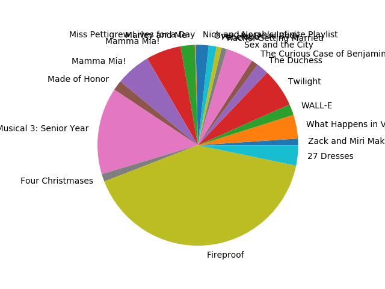
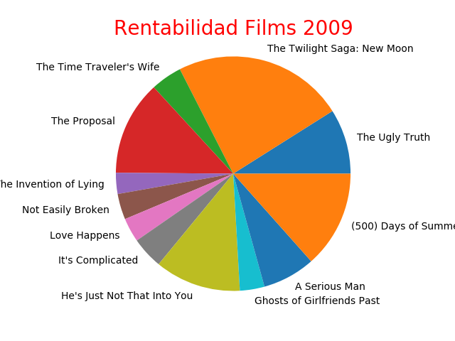

<h1>Proyecto Movies</h1>
<h3>Coder: Jose Alberto Hernandez</h3>

<h2>Resumen</h2>
Una sencillo proyecto de practica de visualizacion de datos desde fuentes csv con la libreria matplotlib de Python
</img>
</img>
</img>

<h2>Origen de movies.csv</h2>
 Es un archivo csv con datos de peliculas top entre los años 2007 y 2011
 This file shows you the top gross movies between 2007 and 2011.
<h3>Todos los creditos son del usuaro tiangechen</h3>
#https://github.com/tiangechen/movies.csv
#https://gist.github.com/tiangechen/b68782efa49a16edaf07dc2cdaa855ea

<h2>Agregar títulos en matplotlib con title y set_title</h2>

Matplotlib permite añadir títulos a los gráficos utilizando la función title o la función set_title. La principal diferencia entre estas dos funciones es que la primera agrega un título para un único gráfico mientras que la segunda permite agregar títulos a varios gráficos de la misma figura. 

plt.title('Título del gráfico', fontsize = 20)
# plt.show()

https://python-charts.com/es/matplotlib/titulos/#:~:text=Matplotlib%20permite%20a%C3%B1adir%20t%C3%ADtulos%20a,gr%C3%A1ficos%20de%20la%20misma%20figura.
